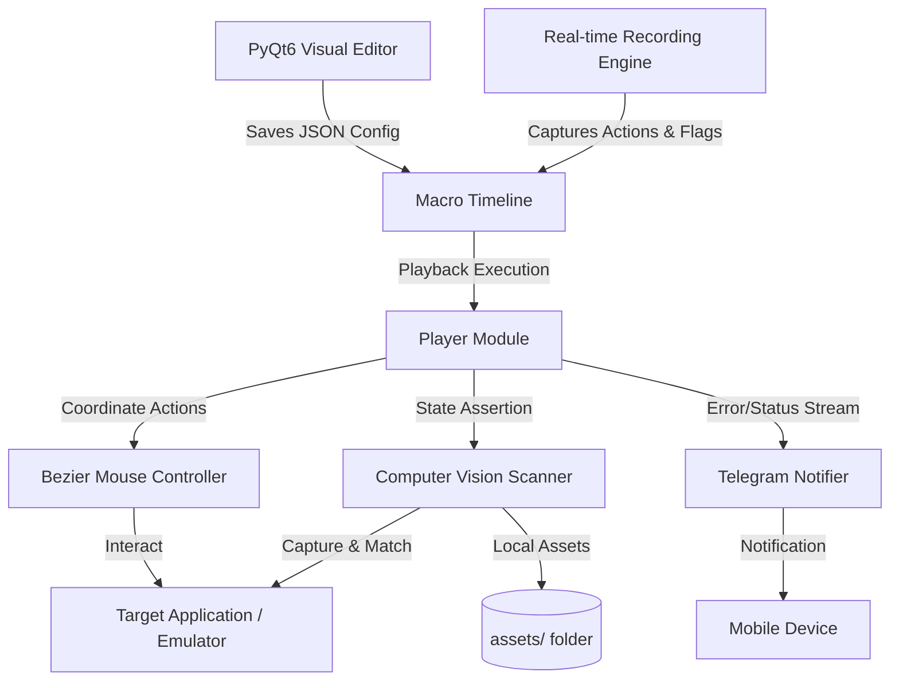

# 🤖 BOT-MACRO

### *Next-Generation Desktop & Game Automation Suite*

Designed for Android emulators (LDPlayer, BlueStacks) and standard Windows applications. Built with a sleek **PyQt6 Visual Editor** and powered by an intelligent **OpenCV Computer Vision Engine**.

<p align="left">
  <a href="https://www.python.org/"></a>
  <a href="https://www.qt.io/"></a>
  <a href="#"></a>
  <a href="#"></a>
  <a href="https://opensource.org/licenses/MIT"></a>
</p>

---

## 📖 Introduction

**BOT-MACRO** is a professional desktop automation suite designed for Android emulators (like LDPlayer and BlueStacks) and standard Windows applications. 

Unlike generic, rigid macro recorders, BOT-MACRO features a high-fidelity **Drag & Drop Visual Editor** for building modular workflows, coupled with an intelligent **OpenCV Computer Vision Engine** that dynamically scans, detects, and interacts with UI elements. It is engineered with robust stealth mechanics to prevent bans and gracefully handle unexpected states or layered popups.

---

## 🌟 Core Features

| Feature | Description | Emojis & Tech |
| :--- | :--- | :--- |
| **Visual Workflow Builder** | Construct robust macro scripts intuitively by dragging and dropping action blocks (Click, Delay, Vision Scan, Sub-Macros) onto an interactive timeline. | 🎨 `PyQt6` |
| **Computer Vision Engine** | Dynamically scans specific window regions for image assets. Recognizes buttons (like close "X" or "Confirm") and triggers automated interactions. | 👁️ `OpenCV` |
| **Anti-Ban Architecture** | Evades bot-detection algorithms through curved mouse trajectories (Bezier curves), random coordinate offsets (+/- 3px), and randomized wait intervals. | 🛡️ `Stealth` |
| **Layered Popup Resolver** | Automatically handles overlapping windows or recursive prompts by executing a persistent re-scan loop, clearing popups one by one. | 🔄 `Resilient` |
| **Modular Sub-Macros** | Break complex pipelines down into highly reusable sub-macros, nesting actions inside main scripts for clean project architecture. | 🧩 `Modular` |
| **Instant Telegram Alerts** | Built-in Telegram integration through BotFather to receive live telemetry, error logs, and failsafe notifications on your mobile device. | 📱 `Telegram API` |

---

## ⚙️ System Architecture



---

## 🚀 Getting Started

Follow this guide to set up BOT-MACRO on your local machine.

### Prerequisites
- **Operating System:** Windows (Required for `pywin32` API integration)
- **Python:** Version [3.10+](https://www.python.org/downloads/) (Ensure you select **"Add Python to PATH"** during installation)
- **Git:** Version [2.x+](https://git-scm.com/downloads)

### Installation
Open your terminal (PowerShell or Command Prompt) and execute the following commands:

```bash
# Clone the repository
git clone https://github.com/marcelluxx/BOT-MACRO.git

# Navigate into the project root
cd BOT-MACRO

# Create a virtual environment
python -m venv .venv

# Activate the virtual environment
.venv\Scripts\activate

# Install the required dependencies
pip install -r requirements.txt
```

---

## 📱 Telegram Integration (Optional)

Configure instant mobile notifications for when your bot encounters a critical error, successfully finishes execution, or is forcefully aborted.

1. Create a bot by talking to [BotFather](https://t.me/botfather) on Telegram and secure your unique **API Token**.
2. Retrieve your chat ID by querying [@userinfobot](https://t.me/userinfobot).
3. Create a `.env` file in the root directory:
   ```env
   TELEGRAM_BOT_TOKEN=your_bot_token_here
   TELEGRAM_CHAT_ID=your_chat_id_here
   ```

---

## 🎮 How to Use

### 1. Launching the Application
Execute the entry point module to start the visual suite:
```bash
# Start with PyQt6 GUI Editor (Recommended)
python main.py

# Start in Legacy CLI Mode
python main.py --cli
```

### 2. Setting Up Vision Templates
Place clean, cropped `.png` image files of buttons or icons you want the bot to detect (such as `ok_button.png` or `close.png`) into the `assets/` directory. The OpenCV Engine scans this directory to automatically target these icons during **Vision Scan** actions.

### 3. Constructing Macro Sequences
* **Visual Editor Method:** Drag actions from the **Toolbox** (left) into the **Timeline** (center). Customize coordinates, delays, and threshold percentages in the **Properties Panel** (right).
* **Macro Recording Method:**
  1. Click **⏺ Record** (or press `F8`).
  2. Perform mouse actions inside your target application window.
  3. Press `F7` during recording to dynamically insert a **Vision Checkpoint** flag (ideal for dynamic loads/popups).
  4. Press `F8` again to finalize recording and save the macro.

---

## ⌨️ Global Hotkeys

These controls work system-wide, even when BOT-MACRO is running in the background:

| Hotkey | Action | Context |
| :--- | :--- | :--- |
| <kbd>F7</kbd> | **Insert Vision Flag** | Active only during recording |
| <kbd>F8</kbd> | **Toggle Recording** | Toggles between Recording and Idle |
| <kbd>F9</kbd> | **Toggle Playback Loop** | Toggles between Playback and Idle |
| <kbd>F12</kbd> / <kbd>ESC</kbd> | **EMERGENCY STOP** | Immediately terminates all operations |

---

## 🔧 Advanced Configuration & Failsafes

### Targeting Specific Application Windows
By default, the script targets **"LDPlayer"**. To automate a standard application or a different emulator:
1. Open `gui/main_window.py` (GUI) or `main.py` (CLI).
2. Locate the constant `WINDOW_TITLE = "LDPlayer"`.
3. Replace `"LDPlayer"` with the exact window name of your target application (e.g., `"BlueStacks App Player"` or `"NoxPlayer"`).

### Physical Failsafe Trigger
If the bot runs out of control and you are unable to press <kbd>F12</kbd> or <kbd>ESC</kbd>, **violently move your physical mouse to any of the four outer corners of your screen**. This triggers the built-in PyAutoGUI failsafe mechanism and instantly terminates the automation thread.

---

## 🤝 Contributing

Contributions make the open-source community an amazing place to learn, inspire, and create. Any contributions you make are **greatly appreciated**.

1. Fork the Project
2. Create your Feature Branch (`git checkout -b feature/AmazingFeature`)
3. Commit your Changes (`git commit -m 'feat: add amazing feature'`)
4. Push to the Branch (`git push origin feature/AmazingFeature`)
5. Open a Pull Request

---

## 📄 License

Distributed under the MIT License. See `LICENSE` for more information.
